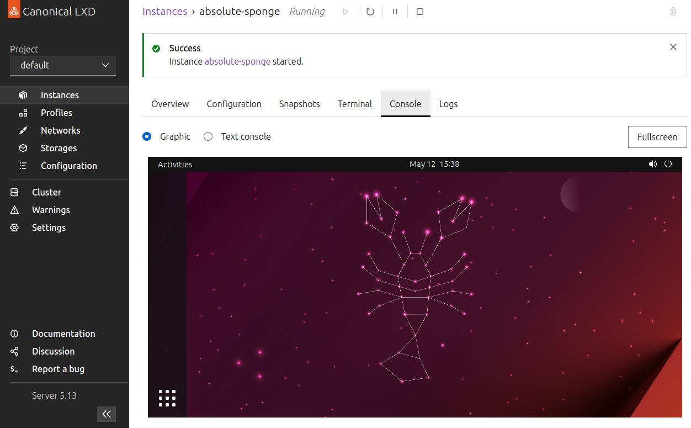

# LXDウェブUIへのアクセス方法

```{important}
現在、LXDウェブUIはLXDスナップの`latest/edge`チャンネルにのみ含まれています。

製品環境でエッジバージョンのLXDを実行することは決してしないでください。
```



```{youtube} https://www.youtube.com/watch?v=wqEH_d8LC1k
```

LXDウェブUIは、LXDサーバーとインスタンスを管理するためのグラフィカルインターフェースを提供します。
現在、初期段階にありまだ全機能を提供していませんが、最終的にはLXDコマンドラインクライアントの代替となるでしょう。

以下の手順を完了してLXDウェブUIにアクセスします：

1. LXDサーバーが{ref}`ネットワークに公開されている <server-expose>`ことを確認します。
   サーバーは{ref}`初期化 <initialize>`中に公開させることができるか、それ以降にサーバー設定オプションの[`core.https_address`](server-options-core)を設定することで公開させることができます。

1. サーバーアドレス（例：`https://192.0.2.10:8443`）を入力して、ブラウザからUIにアクセスします。

   セキュアな{ref}`authentication-server-certificate`を設定していない場合、LXDは自己署名証明書を使用し、ブラウザにセキュリティ警告が表示されます。
   ブラウザの機能を使用して、セキュリティ警告が出ても続行してください。

   

1. UI内で提示される手順に従って、UIクライアントがLXDサーバーと認証するために必要な証明書を設定します。
   これらの手順には、証明書のセットの作成、プライベートキーのブラウザへの追加、公開キーのサーバーのトラストストアへの追加が含まれます。

   詳細については{ref}`authentication`を参照してください。

   

証明書の設定が完了したら、インスタンスの作成、プロファイルの編集、またはサーバーの設定を開始できます。
