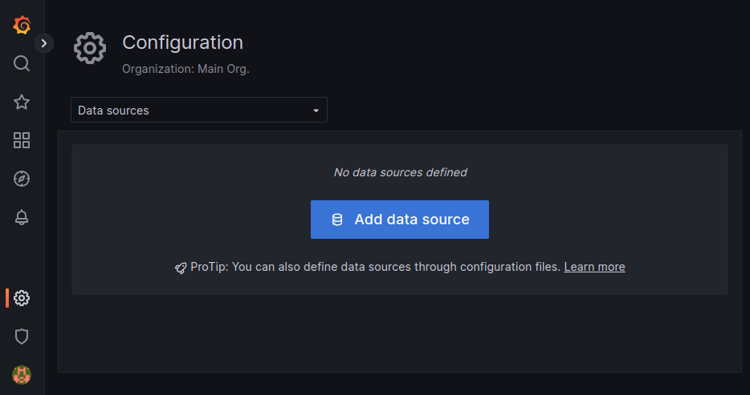
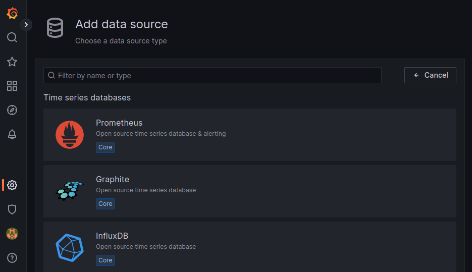
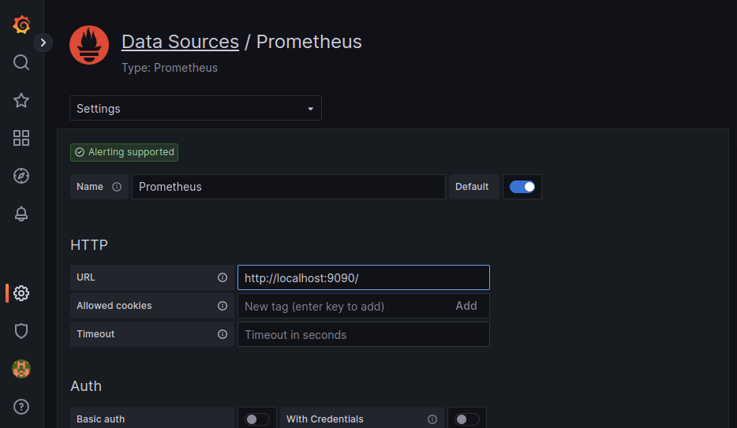
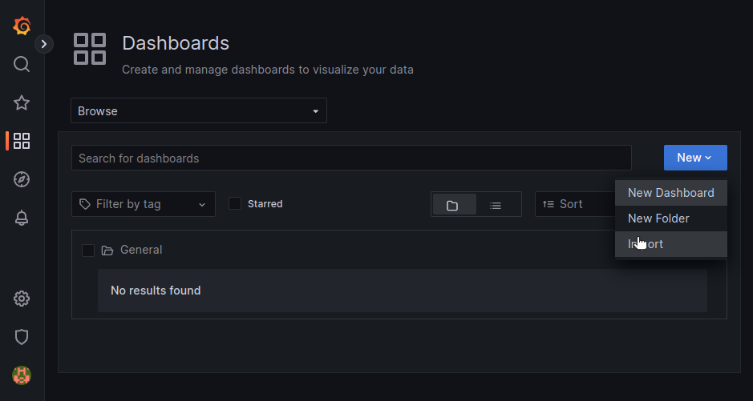
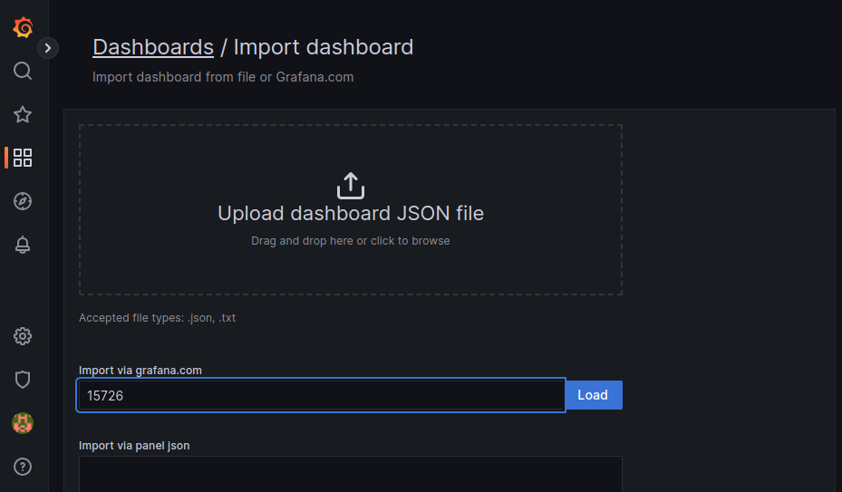
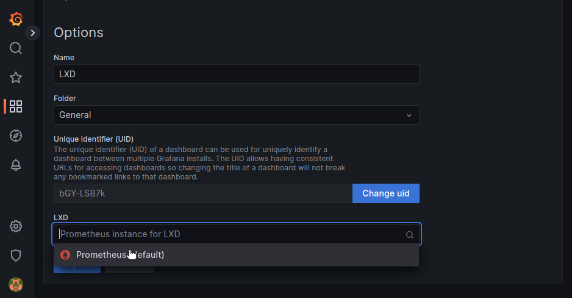
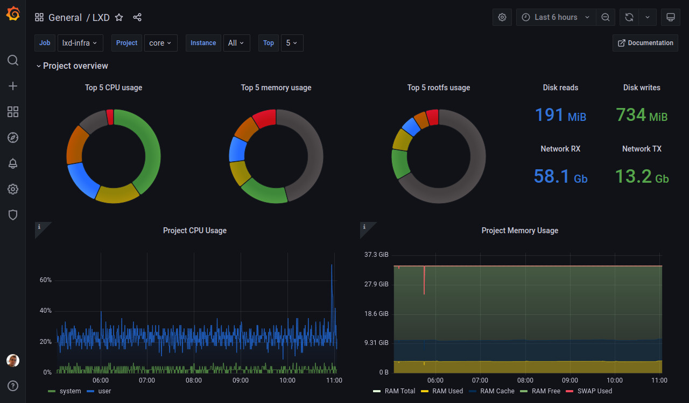
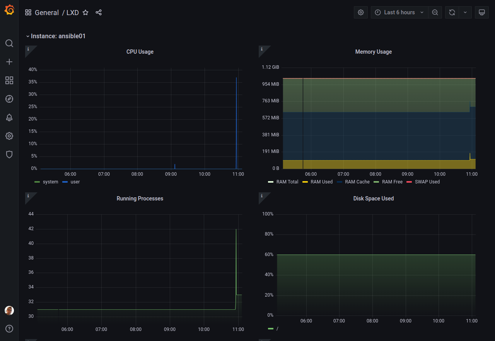

(metrics)=
# メトリクスを監視するには

```{youtube} https://www.youtube.com/watch?v=EthK-8hm_fY
```

<!-- Include start metrics intro -->
LXD は全ての実行中のインスタンスについてのメトリクスといくつかの内部メトリクスを収集します。
これは CPU、メモリー、ネットワーク、ディスク、プロセスの使用量を含みます。
Prometheus で読み取って Grafana でグラフを表示するのに使うことを想定しています。
利用可能なメトリクスの一覧は{ref}`provided-metrics`を参照してください。
<!-- Include end metrics intro -->

クラスタ環境では、 LXD はアクセスされているサーバ上で稼働中のインスタンスの値だけを返します。ですので、各クラスタメンバーから別々にデータを取得する必要があります。。

インスタンスメトリクスは `/1.0/metrics` エンドポイントを呼ぶと更新されます。
複数のスクレイパーに対応するためメトリクスは 8 秒キャッシュします。メトリクスの取得は比較的重い処理ですので、影響が大きすぎるようならデフォルトの間隔より長い間隔でスクレイピングすることを検討してください。

## 生データを取得する

LXDが収集した生データを見るには、`1.0/metrics` エンドポイントに `lxc query` コマンドで問い合わせてください。

```{terminal}
:input: lxc query /1.0/metrics

# HELP lxd_cpu_seconds_total The total number of CPU time used in seconds.
# TYPE lxd_cpu_seconds_total counter
lxd_cpu_seconds_total{cpu="0",mode="system",name="u1",project="default",type="container"} 60.304517
lxd_cpu_seconds_total{cpu="0",mode="user",name="u1",project="default",type="container"} 145.647502
lxd_cpu_seconds_total{cpu="0",mode="iowait",name="vm",project="default",type="virtual-machine"} 4614.78
lxd_cpu_seconds_total{cpu="0",mode="irq",name="vm",project="default",type="virtual-machine"} 0
lxd_cpu_seconds_total{cpu="0",mode="idle",name="vm",project="default",type="virtual-machine"} 412762
lxd_cpu_seconds_total{cpu="0",mode="nice",name="vm",project="default",type="virtual-machine"} 35.06
lxd_cpu_seconds_total{cpu="0",mode="softirq",name="vm",project="default",type="virtual-machine"} 2.41
lxd_cpu_seconds_total{cpu="0",mode="steal",name="vm",project="default",type="virtual-machine"} 9.84
lxd_cpu_seconds_total{cpu="0",mode="system",name="vm",project="default",type="virtual-machine"} 340.84
lxd_cpu_seconds_total{cpu="0",mode="user",name="vm",project="default",type="virtual-machine"} 261.25
# HELP lxd_cpu_effective_total The total number of effective CPUs.
# TYPE lxd_cpu_effective_total gauge
lxd_cpu_effective_total{name="u1",project="default",type="container"} 4
lxd_cpu_effective_total{name="vm",project="default",type="virtual-machine"} 0
# HELP lxd_disk_read_bytes_total The total number of bytes read.
# TYPE lxd_disk_read_bytes_total counter
lxd_disk_read_bytes_total{device="loop5",name="u1",project="default",type="container"} 2048
lxd_disk_read_bytes_total{device="loop3",name="vm",project="default",type="virtual-machine"} 353280
...
```

## Prometheusをセットアップする

生のメトリクスを収集し保管するには、[Prometheus](https://prometheus.io/)をセットアップするのが良いです。
メトリクスAPIエンドポイントを使ってメトリクスを収集するように設定できます。

### メトリクスエンドポイントを公開する

`/1.0/metrics` APIエンドポイントを公開するには、利用可能にするアドレスを設定する必要があります。

そのためには、[`core.metrics_address`](server-options-core)サーバ設定オプションか[`core.https_address`](server-options-core)サーバ設定オプションのいずれかを設定できます。
`core.metrics_address`オプションはメトリクスのみを公開し、`core.https_address`は完全なAPIを公開します。
ですので、完全なAPIとメトリクスのAPIで別のアドレスを使いたい場合、あるいはメトリクスのAPIのみ公開し完全なAPIは公開したくない場合は`core.metrics_address`オプションを設定するのが良いです。

例えば、完全なAPIを`8443`ポートで公開するには、次のコマンドを入力します:

    lxc config set core.https_address ":8443"

メトリクスAPIエンドポイントのみを`8444`ポートで公開するには、次のコマンドを入力します:

    lxc config set core.metrics_address ":8444"

メトリクスAPIエンドポイントのみを指定したIPアドレスとポートで公開するには、次のようなコマンドを入力します:

    lxc config set core.metrics_address "192.0.2.101:8444"

## メトリクス用証明書の追加

`1.0/metrics` エンドポイントは他の証明書に加えて `metrics` タイプの証明書を受け付けるという点で特別なエンドポイントです。
このタイプの証明書はメトリクス専用で、インスタンスや他のLXDのエンティティの操作には使用できません。

新しい証明書は以下のように作成します（この手順はメトリクス用の証明書に限ったものではありません）。

    openssl req -x509 -newkey ec -pkeyopt ec_paramgen_curve:secp384r1 -sha384 -keyout metrics.key -nodes -out metrics.crt -days 3650 -subj "/CN=metrics.local"

```{note}
上のコマンドは OpenSSL 1.1.0またはそれ以降が必要です。
```

作成後、証明書を信頼済みクライアントのリストに`metrics`というタイプを指定して追加する必要があります。

    lxc config trust add metrics.crt --type=metrics

## メトリクス用証明書をPrometheusで利用可能にする

PrometheusをLXDサーバと別のマシンで稼働させる場合、必要な証明書をPrometheusのマシンにコピーする必要があります。

- 作成したメトリクス用証明書(`metrics.crt`)と鍵(`metrics.key`) 
- `/var/snap/lxd/common/lxd/` (snapを使用している場合)あるいは`/var/lib/lxd/` (それ以外)に置かれているLXDサーバ証明書(`server.crt`)

これらのファイルをPrometheusにアクセスできる`tls`ディレクトリ、例えば、`/var/snap/prometheus/common/tls`(snapを使用している場合)あるいは`/etc/prometheus/tls` (それ以外)にコピーしてください。
次の例のコマンドを参照してください:

```bash
# tls ディレクトリーを作成
mkdir /var/snap/prometheus/common/tls

# 新規に作成された証明書と鍵を tls ディレクトリーにコピー
cp metrics.crt metrics.key /var/snap/prometheus/common/tls/

# LXD サーバ証明書を tls ディレクトリーにコピー
cp /var/snap/lxd/common/lxd/server.crt /var/snap/prometheus/common/tls/
```

Snapを使っていない場合、さらにPrometheusがこれらのファイルを読めるように(通常、Prometheusは`prometheus`ユーザで稼働しています)する必要があります。

    chown -R prometheus:prometheus /etc/prometheus/tls

### PrometheusをLXDからデータ収集できるように設定する

最後に、 LXD をターゲットとしてPrometheusの設定に追加する必要があります。

そのためには、`/var/snap/prometheus/current/prometheus.yml` (snapを使用している場合)あるいは`/etc/prometheus/prometheus.yaml` (それ以外)を編集し、LXDにジョブを追加します。

必要な設定は以下のようになります:

```yaml
scrape_configs:
  - job_name: lxd
    metrics_path: '/1.0/metrics'
    scheme: 'https'
    static_configs:
      - targets: ['foo.example.com:8443']
    tls_config:
      ca_file: 'tls/server.crt'
      cert_file: 'tls/metrics.crt'
      key_file: 'tls/metrics.key'
      # XXX: server_name は targets のホスト名が証明書でカバーされない
      #      (証明書の SAN リストに含まれない) 場合は必須です
      server_name: 'foo'
```

````{note}
LXD証明書が`targets`リスト内で使用するのと同じホスト名を含まない場合は`server_name`の指定は必須です。
これを確認するには、`server.crt`を開いて Subject Alternative Name (SAN) セクションを確認してください。

例えば、`server.crt` が以下の内容を持つとします:

```{terminal}
:input: openssl x509 -noout -text -in /var/snap/prometheus/common/tls/server.crt

...
            X509v3 Subject Alternative Name:
                DNS:foo, IP Address:127.0.0.1, IP Address:0:0:0:0:0:0:0:1
...
```

Subject Alternative Name (SAN) リストが `targets` リスト(`foo.example.com`)のホスト名を含んでいないので、 `server_name` ディレクティブを使用して比較に使用する名前を上書きする必要があります。
````

以下は複数の LXD サーバのメトリックを収集するために複数のジョブを使用する `prometheus.yaml` の設定例です。

```yaml
scrape_configs:
  # abydos, langara, orilla は最初にabydosからブートストラップした単一クラスタで
  # (ここでは`hdc`と呼びます)、このため3ノードで`ca_file`と`server_name`を共有しています。
  # `ca_file`はLXDクラスタの各メンバー上に存在する`/var/snap/lxd/common/lxd/cluster.crt`
  # ファイルに対応しています。
  #
  # 注意: `project`パラメータは`default`プロジェクトを使用しないか複数のプロジェクトを
  #       使用する場合に提供されます。
  #
  # 注意: クラスタの各メンバーはローカルで稼働するインスタンスのメトリクスだけを提供します。
  #       これが`lxd-hdc`クラスタが3つのターゲットを一覧表示している理由です。
  - job_name: "lxd-hdc"
    metrics_path: '/1.0/metrics'
    params:
      project: ['jdoe']
    scheme: 'https'
    static_configs:
      - targets:
        - 'abydos.hosts.example.net:8444'
        - 'langara.hosts.example.net:8444'
        - 'orilla.hosts.example.net:8444'
    tls_config:
      ca_file: 'tls/abydos.crt'
      cert_file: 'tls/metrics.crt'
      key_file: 'tls/metrics.key'
      server_name: 'abydos'

  # jupiter, mars, saturn は3つのスタンドアロンの LXD サーバです。
  # 注意: これらでは`default`プロジェクトのみが使用されているため、プロジェクトの設定は省略しています。
  - job_name: "lxd-jupiter"
    metrics_path: '/1.0/metrics'
    scheme: 'https'
    static_configs:
      - targets: ['jupiter.example.com:9101']
    tls_config:
      ca_file: 'tls/jupiter.crt'
      cert_file: 'tls/metrics.crt'
      key_file: 'tls/metrics.key'
      server_name: 'jupiter'

  - job_name: "lxd-mars"
    metrics_path: '/1.0/metrics'
    scheme: 'https'
    static_configs:
      - targets: ['mars.example.com:9101']
    tls_config:
      ca_file: 'tls/mars.crt'
      cert_file: 'tls/metrics.crt'
      key_file: 'tls/metrics.key'
      server_name: 'mars'

  - job_name: "lxd-saturn"
    metrics_path: '/1.0/metrics'
    scheme: 'https'
    static_configs:
      - targets: ['saturn.example.com:9101']
    tls_config:
      ca_file: 'tls/saturn.crt'
      cert_file: 'tls/metrics.crt'
      key_file: 'tls/metrics.key'
      server_name: 'saturn'
```

設定を編集後、Prometheusを再起動する（例えば、`snap restart prometheus`）とデータ収集を開始します。

## Grafanaダッシュボードをセットアップする

メトリクスデータを可視化するには、[Grafana](https://grafana.com/)を設定します。
LXDは、Prometheusによって収集されたLXDメトリクスを表示するように設定された[Grafanaダッシュボード](https://grafana.com/grafana/dashboards/15726-lxd/)を提供します。

```{note}
このダッシュボードはGrafana 8.4以降が必要です。
```

Grafanaのドキュメントを参照して、インストールとサインインの手順を確認してください:

- [Grafanaをインストールする](https://grafana.com/docs/grafana/latest/setup-grafana/installation/)
- [Grafanaにサインインする](https://grafana.com/docs/grafana/latest/setup-grafana/sign-in-to-grafana/)

次の手順で[LXDダッシュボード](https://grafana.com/grafana/dashboards/15726-lxd/)をインポートします:

1. Prometheusをデータソースとして設定します:

   1. {guilabel}`Configuration` > {guilabel}`Data sources`に移動します。
   1. {guilabel}`Add data source`をクリックします。

      

   1. {guilabel}`Prometheus`を選択します。

      

   1. {guilabel}`URL`フィールドに`http://localhost:9090/`を入力します。

      

   1. 他のフィールドはデフォルトの設定のままにし、{guilabel}`保存＆テスト`をクリックします。

1. LXDダッシュボードをインポートします:

   1. {guilabel}`Dashboards` > {guilabel}`Browse`に移動します。
   1. {guilabel}`New`をクリックし、{guilabel}`Import`を選択します。

      

   1. {guilabel}`Import via grafana.com`フィールドにダッシュボードID `15726`を入力します。

      

   1. {guilabel}`Load`をクリックします。
   1. {guilabel}`LXD`のドロップダウンメニューから、設定したPrometheusのデータソースを選択します。

      

   1. {guilabel}`Import`をクリックします。

これでLXDダッシュボードが表示されるはずです。
プロジェクトを選択し、インスタンスによってフィルタリングすることができます。



ページの下部で、各インスタンスのデータを見ることができます。


